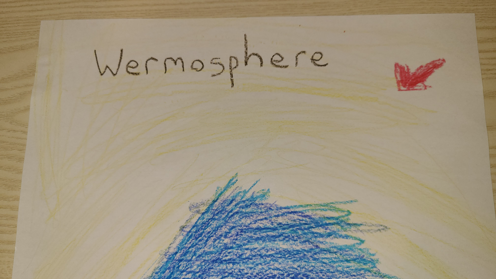
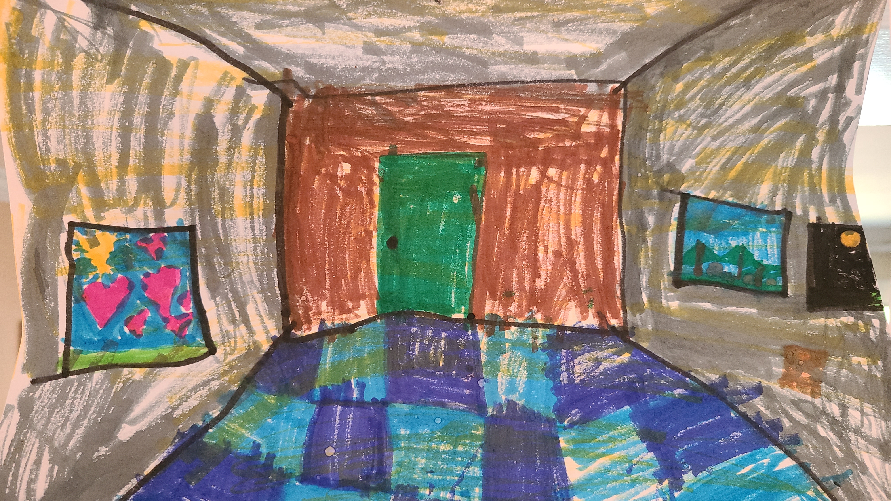

## New Discoveries

### The Wermosphere

The Wermosphere is a newly discovered layer of the atmosphere. It sits below the tree line and protects us from the sun's invisible light.

Here is an illustration of the Wermosphere:

It was discovered by a boy named Dax on May 16th, 2026.

### Dax's Illustrations

Perspective:

### Cupcake World by Dax Karker-Chou

<iframe
    src="/storybook.html"
    width="100%"
    height="900"
    style="border:none;">
</iframe>

