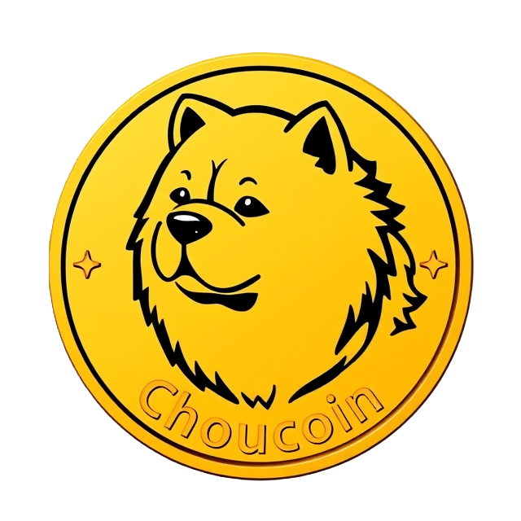

# Choucoin&copy;

* * *

## Introduction

### Welcome to the future

Hi all, if you're here, no doubt you're interested in obtaining and trading the _fastest_ growing cryptocurrency of 2025, Choucoin&copy;.

This revolutionary cryptocurrency is poised to _revolutionize_ how goods and services are traded all around the world. 

### What is Choucoin&copy;?

I just told you! It's the future! What do you mean? What's a cryptocurrency? C'mon everybody knows that a cryptocurrency is. You know, it's the blockchain and the stuff with the numbers and computers. Also, security, because... you know... it is called *crypto*currency, so obviously cryptography is making it secure and stuff. Anyways, dumb question. Let's move on.

### How can I obtain Choucoin&copy;?

This incredibly sought-after and rare currency is only obtainable by receiving it from someone who already owns it! That's right, it's impossible to obtain.

Lucky for you, by signing up for Professor Chou's **Cryptography** class, you can receive newly minted Choucoin&copy;. For the Spring semester of 2025, each student will receive 20 Choucoin&copy; upon turning in the first homework assignment.

## Setting up a Choucoin&copy; wallet

To begin trading Choucoin&copy;, you first need to set up a wallet. A wallet will contain

*    An identifying name
*    A public/private key pair

You will find tools to generate a public/private key pair on the [Choucoin&copy; Tools](./choucoin.html) page.

## Trading Choucoin&copy;

### Making a transaction

All transactions should be posted on the class Canvas discussion board.

You may make posts under a name there, but note that anyone can choose any name, so a transaction should not be trusted simply by name alone!

Alice bought an item from Bob for 3 Choucoin. The person who is _giving_ the Choucoin needs to go post the transaction. Alice will navigate to the [transaction tool](./send-choucoin.html). This will generate a text message that is signed by uploading her personal key file.

> Alice sends 3 Choucoin to Bob for cookies on 2025-01-14T18:15:00, signed: 26010574517299467705133524531951449443160637616806667514746447492490615128182

This text output is the actual message we want to post to the transaction forum.

## Verifying transactions, securing the ledger

# Choucoin&copy; tools

[Crypto Functions](./cryptofuncs.html).

[Choucoin&copy; Tools](./choucoin.html).

[Choucoin transactions](./posts.html).

